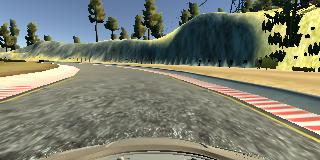
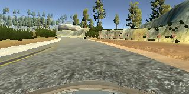
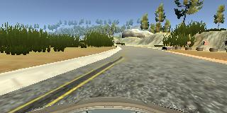
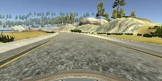

# **Behavioral Cloning** 


The goals / steps of this project are the following:
* Use the simulator to collect data of good driving behavior
* Build, a convolution neural network in Keras that predicts steering angles from images
* Train and validate the model with a training and validation set
* Test that the model successfully drives around track one without leaving the road
* Summarize the results with a written report


---
### Files Submitted & Code Quality

#### Submission includes all required files and can be used to run the simulator in autonomous mode

My project includes the following files:
* model.py containing the script to create and train the model
* drive.py for driving the car in autonomous mode
* model.h5 containing a trained convolution neural network 
* writeup_report.md summarizing the results

#### Submission includes functional code
Using the Udacity provided simulator and my drive.py file, the car can be driven autonomously around the track by executing 
```sh
python drive.py model.h5
```

#### Submission code is usable and readable

The model.py file contains the code for training, argumenting and saving the convolution neural network. The file shows the pipeline I used for training and validating the model as well. 

### Model Architecture and Training Strategy

I used the NVIDIA models in this project [paper](http://images.nvidia.com/content/tegra/automotive/images/2016/solutions/pdf/end-to-end-dl-using-px.pdf). The network consists of 9 layers which includes 5 Convolutional Layers, 3 Fully Connected Layer and a Normalization layer. The image of the architecture can be found on page 5 (figure 4) 

The images was argumented by cropping out parts like sky, trees and the front of the car to prevent distraction in the model. Example of the images is as follows

Before cropping. 



After cropping.


The model was trained with randomly augmented dataset and validated on different data sets to ensure that the model was not overfitting (code line 10-16). The model was tested by running it through the simulator and ensuring that the vehicle could stay on the track.

#### Model parameter tuning

The model used an adam optimizer, so the learning rate was not tuned manually (model.py line 25).

#### Appropriate training data

Training data was chosen to keep the vehicle driving on the road. I used a combination of center lane driving, recovering from the left and right sides of the road, driving in the opposite direction and recovering from off-road.

For details about how I created the training data, see the next section. 

### Model Architecture and Training Strategy

#### Solution Design Approach

The overall strategy for deriving a model architecture was to use the NVIDIA architecture provided in the documents. 

In order to gauge how well the model was working, I split my image and steering angle data into a 80% training and 20% validation set.

My first step was to implement the NVIDIA model without argumenting. I found that the model had a low mean squared error on the training set but a high mean squared error on the validation set. This implied that the model was overfitting. 

I ran the result on the simulator, The car was driving off road and wasn't able to recover from it.

So in the second step, I applied some argumentation on the dataset to generalize the model. So I applied flipping the image and recovery on both sides when the car is in a bend, cropping the image. 

I ran the result on the simulator, The car was able to drive autonomously for a while but it went off road after the bridged where their was no pavement line on the side of the road.


In the third step, I further argumented the dataset by applying random shadow, brightness of the images and translating the image. The model was still overfitting and the car was getting better at driving but still drift off the road at times.

I played around with various learning rate, number of epoch and applied dropouts, I finally got a low mean squared error on both training and validation set with the following parameters

* Learning rate: 0.0001
* Number of epoach: 3
* 1 Dropout
* 5 Convolutional Layer
* 3 Fully Connected Layer
* 1 Normalization layer

 
The final step when I ran the simulator to see how well the car was driving around track one. At the end of the process, the vehicle is able to drive autonomously around the track without leaving the road.

#### Final Model Architecture

The final model architecture (model.py lines 18-24) consisted of a convolution neural network with the following layers and layer sizes 
```python
def E2ENet():
  model = Sequential()
  model.add(Lambda(lambda x: ((x/255.0) - 0.5), input_shape=(row, col, ch)))
  model.add(Cropping2D(cropping=((70, 20), (0,0))))
  model.add(Conv2D(24, (5, 5), strides=(2, 2), activation='relu'))
  model.add(Conv2D(36, (5, 5), strides=(2,2), activation='relu'))
  model.add(Conv2D(48, (5, 5), strides=(2,2), activation='relu'))
  model.add(Conv2D(64, (3, 3), activation='relu'))
  model.add(Conv2D(64, (3, 3), activation='relu'))
  model.add(Flatten())
  model.add(Dense(100))
  model.add(Dense(50))
  model.add(Dense(10))
  model.add(Dense(1))
```

#### Creation of the Training Set & Training Process

To capture good driving behavior, I first recorded two laps on track one using center lane driving. Here is an example image of center lane driving




I then recorded the vehicle recovering from the left side and right sides of the road back to center so that the vehicle would learn to .... These images show what a recovery looks like starting from ... :





Then I repeated this process on track two in order to get more data points.

To augment the data sat, I also flipped images and angles to generalize the image fed into the model. 

I finally randomly shuffled the data set where 70% training set and 30% of validation set. 
